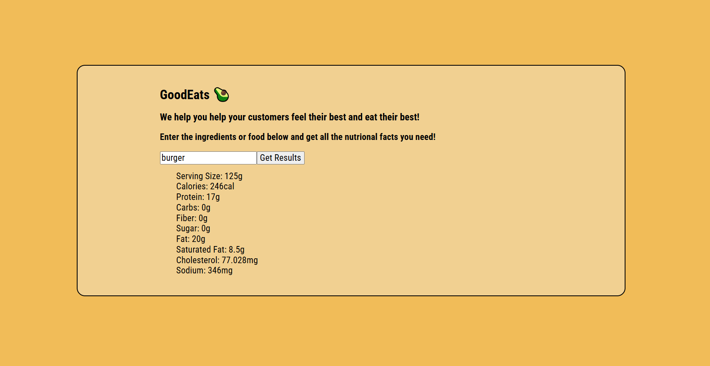

# GoodEats

A simple front-end web app for restaurant owners, managers, and staff. Search for a food and GoodEats shows its nutrition facts, so the restaurant can answer customer questions and add accurate nutrition info to its menu.

## Why It's Useful

Customers ask about calories, protein, carbs, and more, and many are tracking what they eat. Some restaurants also need to show nutrition information on their menus. GoodEats gives staff a fast way to look up a food's nutrition facts without digging through labels or guessing.

## How It Works

1. The user types a food into the search bar, like "pizza" or "burger."
2. The app sends a request to the Dietly API.
3. The nutrition facts for that food are displayed on the page as a list.
4. Each new search clears the old results, so only the current food is shown.

## How It's Made

**Tech used:** HTML, CSS, JavaScript

**API:** [Dietly](https://api.getdietly.com)

The page is built with HTML and styled with CSS. JavaScript takes the food the user searches for, uses the Fetch API to request its nutrition data, parses the JSON response, and builds a list of the results in the DOM. Before each new search, the results list is cleared so old results don't pile up.